# AWS Glue Data Pipeline

An event-driven AWS data pipeline for processing sales data using Amazon S3, AWS Lambda, AWS Glue Workflow, AWS Glue Crawler, AWS Glue Data Catalog, and AWS Glue Python Shell.

The infrastructure is provisioned and managed using AWS CloudFormation and GitHub Actions CI/CD.

## 1. Architecture

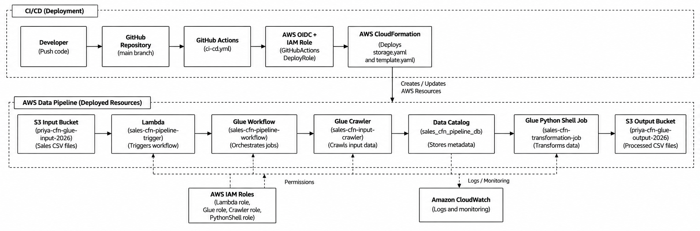


## 2. Manual Pipeline Flow

The pipeline follows an event-driven architecture:

1. Sales CSV data is placed in the S3 input bucket.
2. An S3 ObjectCreated event triggers the Lambda function.
3. Lambda starts the AWS Glue Workflow.
4. The Glue Workflow starts the input crawler.
5. The crawler scans the input data and updates the AWS Glue Data Catalog.
6. After successful crawler execution, the transformation job is triggered.
7. The Glue Python Shell job reads and transforms the sales data.
8. The processed data is written to the S3 output bucket.

### Overall Flow

```text
S3 Input
   ↓
Lambda
   ↓
Glue Workflow
   ↓
Glue Crawler
   ↓
Data Catalog
   ↓
Glue Python Shell Job
   ↓
S3 Output
```

## 3. AWS Resources

| Resource                | Name                           |
| ----------------------- | ------------------------------ |
| Input S3 Bucket         | `priya-cfn-glue-input-2026`    |
| Output S3 Bucket        | `priya-cfn-glue-output-2026`   |
| Scripts S3 Bucket       | `priya-cfn-glue-scripts-2026`  |
| Lambda Function         | `sales-cfn-pipeline-trigger`   |
| Glue Workflow           | `sales-cfn-pipeline-workflow`  |
| Glue Crawler            | `sales-cfn-input-crawler`      |
| Glue Python Shell Job   | `sales-cfn-transformation-job` |
| Glue Database           | `sales_cfn_pipeline_db`        |
| GitHub Actions IAM Role | `GitHubActionsDeployRole`      |

## 4. Repository Structure

```text
aws-glue-data-pipeline/
│
├── .github/
│   └── workflows/
│       ├── ci-cd.yml
│       └── destroy.yml
│
├── cloudformation/
│   ├── storage.yaml
│   └── template.yaml
│
├── data/
│   ├── sample_sales.csv
│   └── sample_sales_test.csv
│
├── docs/
│   └── Screenshots/
│       ├── cicd_buckets.png
│       ├── deploy.png
│       ├── destroy.png
│       ├── input.png
│       ├── output.png
│       ├── scripts.png
│       ├── wf_details.png
│       ├── workflow.png
│       └── workflow_success.png
│
├── glue/
│   └── sales_transformation.py
│
└── lambda/
    └── lambda_function.py
```

## 5. Data Transformation

The AWS Glue Python Shell job performs the following transformations on the sales data:

* Removes leading and trailing whitespace from customer names.
* Converts customer names to uppercase.
* Converts status values to uppercase.
* Converts city names to title case.
* Standardizes order dates to `YYYY-MM-DD`.
* Calculates `total_amount` using quantity and unit price.
* Applies discounts based on order status.
* Calculates `discount_amount`.
* Calculates `final_amount`.
* Rounds monetary and percentage values.
* Generates a processed CSV file.

### Example

```text
Input:
sample_sales.csv

Output:
processed_sample_sales.csv
```

## 6. AWS Glue Workflow

The Glue Workflow orchestrates the processing sequence.

```text
Start Crawler
      ↓
Input Crawler
      ↓
Crawler Success Trigger
      ↓
Transformation Job
```

The workflow ensures that the transformation job starts only after the crawler completes successfully.

## 7. AWS Glue Crawler and Data Catalog

The crawler scans the S3 input location and discovers the structure of the incoming sales data.

The discovered metadata is stored in:

```text
Database:
sales_cfn_pipeline_db
```

The Data Catalog provides a centralized metadata layer for the processed data pipeline.

## 8. AWS Lambda

The Lambda function acts as the event-driven trigger for the pipeline.

```text
Function:
sales-cfn-pipeline-trigger
```

When a new object is created in the input S3 bucket, Lambda receives the S3 event and starts:

```text
sales-cfn-pipeline-workflow
```

The workflow receives the input bucket, input file, and output bucket information through workflow run properties.

## 9. CloudFormation

The AWS infrastructure is defined using CloudFormation templates.

### `cloudformation/storage.yaml`

Creates the S3 storage resources:

* Input bucket
* Output bucket
* Scripts bucket

### `cloudformation/template.yaml`

Defines the pipeline resources:

* IAM roles
* Lambda function
* S3 notification configuration
* Glue Data Catalog database
* Glue crawler
* Glue Python Shell job
* Glue workflow
* Workflow triggers

Using CloudFormation allows the infrastructure to be consistently created, updated, and removed.

## 10. CI/CD with GitHub Actions

GitHub Actions is used to automate the CloudFormation deployment process.

### Deploy Workflow

File:

```text
.github/workflows/ci-cd.yml
```

The deployment workflow:

1. Checks out the repository.
2. Configures AWS credentials using GitHub OIDC.
3. Deploys the S3 storage CloudFormation stack.
4. Packages the Lambda function.
5. Uploads the Lambda package to the scripts bucket.
6. Uploads the Glue transformation script to the scripts bucket.
7. Validates the CloudFormation pipeline template.
8. Deploys the pipeline CloudFormation stack.

### Destroy Workflow

File:

```text
.github/workflows/destroy.yml
```

The destroy workflow:

1. Configures AWS credentials using GitHub OIDC.
2. Cleans the CloudFormation-managed S3 buckets.
3. Deletes the CloudFormation storage stack.
4. Waits for the stack deletion to complete.

This provides a controlled way to remove the verification environment after testing.

## 11. IAM and Security

The project uses IAM roles to provide permissions to AWS services.

GitHub Actions authenticates with AWS using OpenID Connect (OIDC), avoiding the use of long-lived AWS access keys.

The GitHub Actions deployment role is:

```text
GitHubActionsDeployRole
```

Separate IAM roles are used for:

* AWS Glue Crawler
* AWS Glue Job
* Lambda
* S3 notification configuration

## 12. Screenshots

Screenshots demonstrating the deployment and successful pipeline execution are stored under:

```text
docs/Screenshots/
````

### 12.1 GitHub Actions Deployment

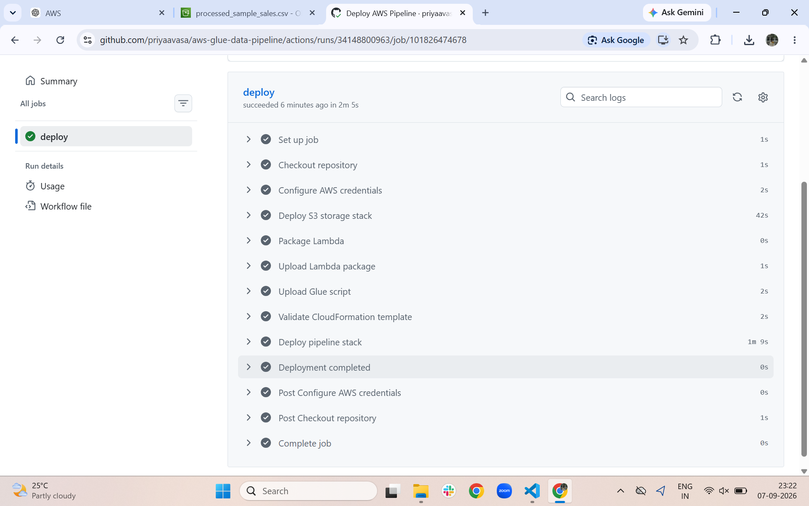

Shows the successful GitHub Actions deployment workflow, including AWS authentication, CloudFormation deployment, Lambda packaging, Glue script upload, template validation, and pipeline stack deployment.

### 12.2 CloudFormation S3 Resources

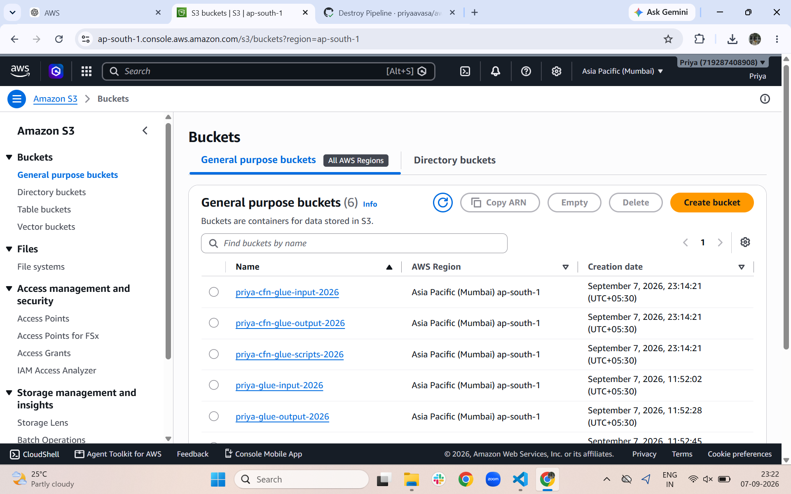

Shows the S3 buckets created for the CloudFormation-managed pipeline, including the input, output, and scripts buckets.

### 12.3 Glue Scripts

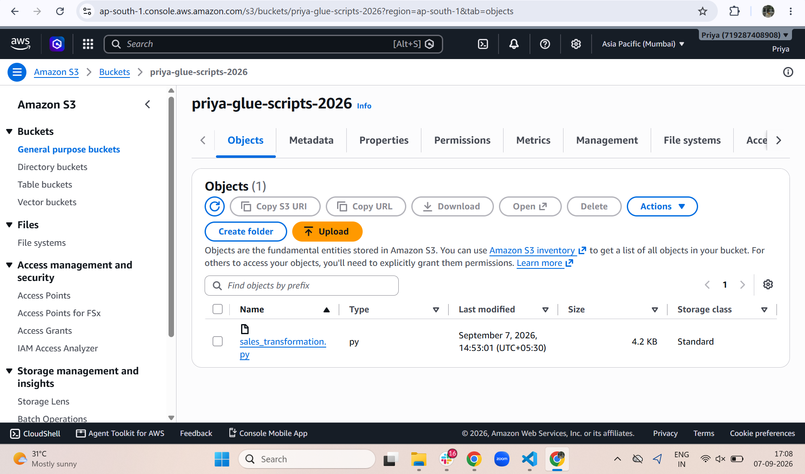

Shows the Glue transformation script stored in the scripts S3 bucket.

### 12.4 Input Data

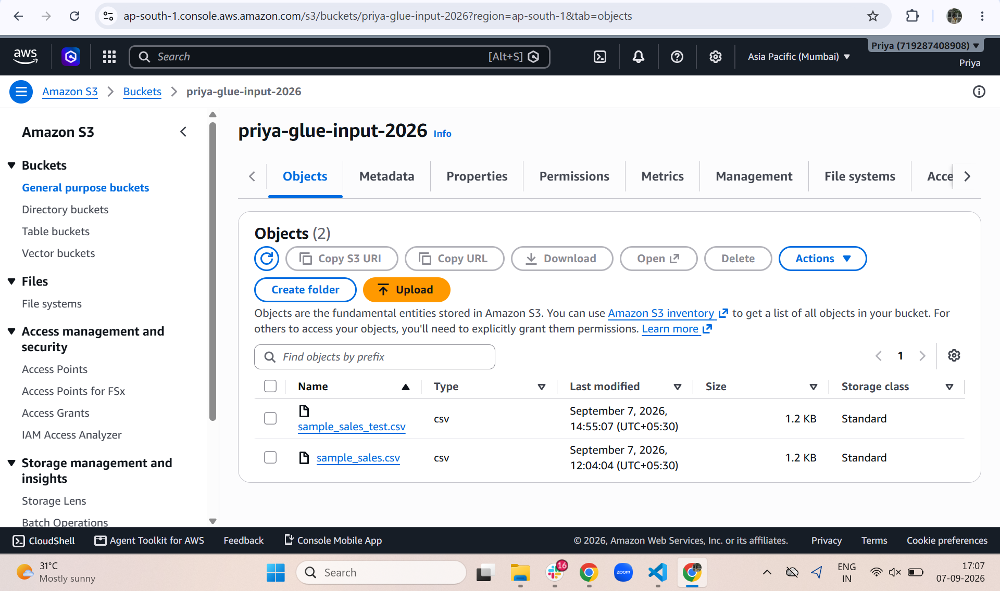

Shows the sales CSV files available in the S3 input bucket.

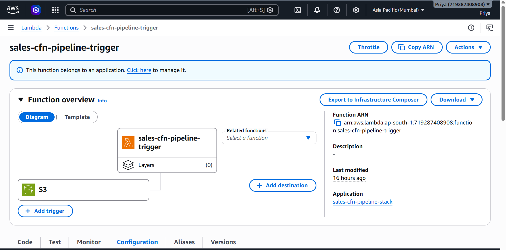

### 12.5 Glue Workflow Details

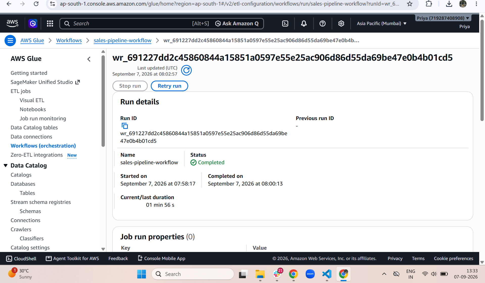

Shows the CloudFormation-managed Glue Workflow and its successful last-run status.

### 12.6 Glue Workflow Graph

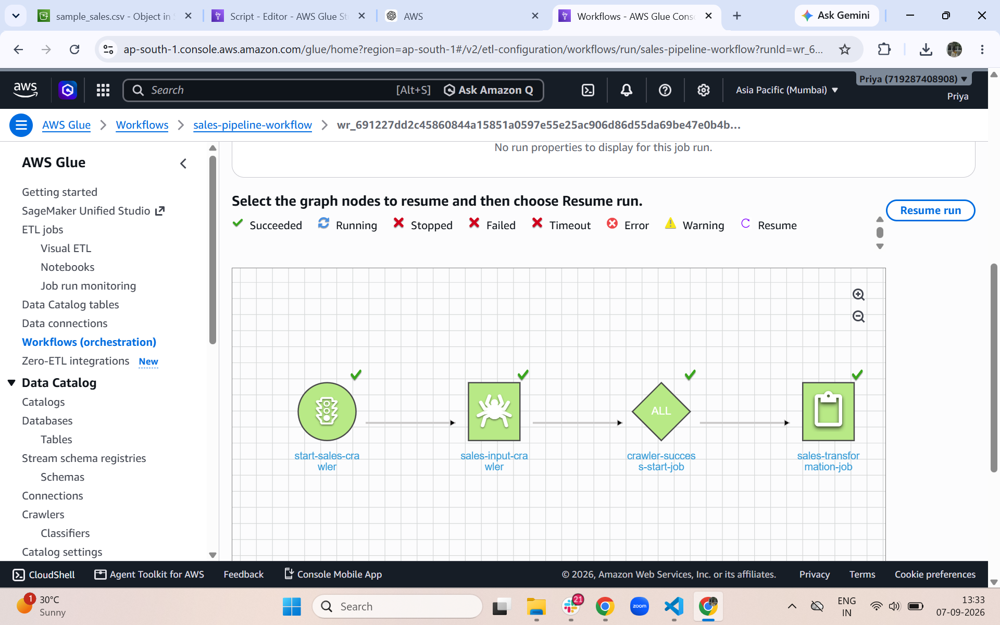

Shows the orchestration sequence:

```text
Crawler Start
      ↓
Input Crawler
      ↓
Crawler Success
      ↓
Transformation Job
```

### 12.7 Successful Workflow Execution

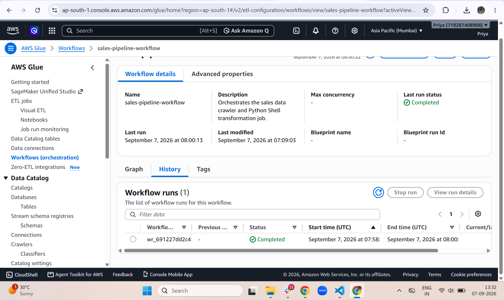

Shows a successfully completed Glue Workflow run, confirming that the crawler and transformation stages completed successfully.

### 12.8 Output Data

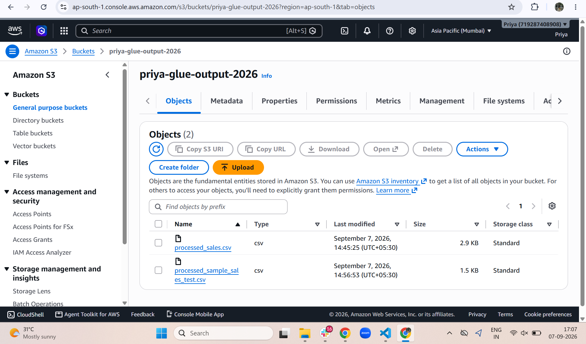

Shows the processed CSV files generated by the Glue transformation job and stored in the S3 output bucket.

### 12.9 Destroy Workflow

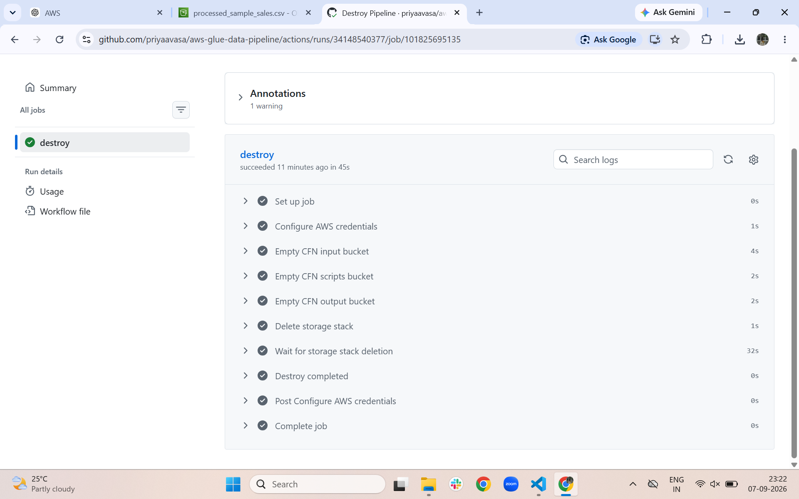

Shows the successful GitHub Actions destroy workflow used to remove the CloudFormation-managed verification environment.

## 13. CI/CD Deployment Flow

```text
GitHub Repository
       ↓
GitHub Actions
       ↓
AWS OIDC Authentication
       ↓
AWS CloudFormation
       ↓
AWS Infrastructure
       ↓
S3 → Lambda → Glue Workflow
       ↓
Glue Crawler → Data Catalog
       ↓
Glue Python Shell
       ↓
S3 Output
```
